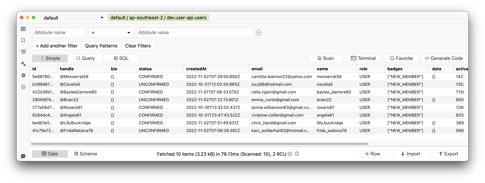

# Serverless User Management & Authentication API

One-click deployment for secure user management, user registration, authentication and management of user profile data.

## AWS resources

- IAMs
- API Gateway
- Lambda
- Cognito
- DynamoDB
- DynamoDB Streams
- S3 (static assets)

## Features

- User management (DynamoDB)
  - New user registration / sign-up
  - Account activation
  - Managing arbitrary user profile data via CRUD interface
  - Automatically deploy static assets to a public S3 bucket (user avatar icons and badges (see `/assets`)
- Auth server (Cognito)
  - Authorization using credentials and access token flow
  - Authentication using ID tokens
  - 3 default Cognito user groups `USER`, `MODERATOR` and `ADMIN` (new registrations default to `USER`)

## What's not included

- Activation email flow
- Password reset / forgot password / email flow
- Social media login (supported by Cognito but out of scope for this project)

For email sending, this could be handled in a separate Lambda function listening for events (EventBridge) or use built-in email features in Cognito.

## Prerequisites

- AWS account with sufficient permissions
- AWS Cognito User Pool and client (client name required for `serverless.yml`)
- API key in AWS Secrets Manager e.g. `dev/user-api/api-key`
- AWS CLI for localhost deployments

## Required setup

You _must_ perform the following steps before running `sls deploy`:

- Create API key in Secrets Manager and add key name to `serverless.yaml` > `custom.apiKeys[0].value`
- Create a Cognito User Pool and client and add the client name to `serverless.yaml` > `custom.cognitoClientName`

## Install dependencies

```
yarn
```

## Deploy

Spin up the stack, and copy static assets in S3 bucket:

```
sls deploy
```

## Seed (TOODs)

Create 100 tests users

```
yarn seed:user
```

## Route table

| Method   | Path                                     | Usage                                                                                                                                                   | Route type | ACL          |
| :------- | :--------------------------------------- | :------------------------------------------------------------------------------------------------------------------------------------------------------ | :--------- | :----------- |
| `GET`    | `/public/user/me`                        | Return user profile data for a valid access token. Useful for rendering a user's account page while letting Cognito implicitly handle the authorization | Public     | Bearer token |
| `POST`   | `/auth/login`                            | Exchange credentials for an access token                                                                                                                | S2S        | API key      |
| `GET`    | `/auth/token/{tokenType}/verify/{token}` | Verify token. Types = `access` or `id` (derived from Cognito)                                                                                           | S2S        | API key      |
| `POST`   | `/user`                                  | Register new user                                                                                                                                       | S2S        | API key      |
| `GET`    | `/user/id`                               | Get user by ID                                                                                                                                          | S2S        | API key      |
| `GET`    | `/user/name/{name}`                      | Get user by name (GSI)                                                                                                                                  | S2S        | API key      |
| `GET`    | `/user/email/{email}`                    | Get user by email (GSI)                                                                                                                                 | S2S        | API key      |
| `GET`    | `/user/handle/{handle}`                  | Get user by handle e.g `@SomePerson` (GSI)                                                                                                              | S2S        | API key      |
| `GET`    | `/user/activate/{activationCode}`        | Activate user (changes status to `UserStatus.CONFIRMED` (GSI)                                                                                           | S2S        | API key      |
| `PATCH`  | `/user/{id}/status/{status}`             | Update user status                                                                                                                                      | S2S        | API key      |
| `PUT`    | `/user/{id}/data/update`                 | Fully update arbitrary user data blob (replace)                                                                                                         | S2S        | API key      |
| `PATCH`  | `/user/{id}/data/update`                 | Partially update arbitrary user data blob (merge)                                                                                                       | S2S        | API key      |
| `POST`   | `/user/{id}/badge/{name}`                | Issue badge to a user e.g `CONVERSATION_STARTER`                                                                                                        | S2S        | API key      |
| `DELETE` | `/user/{id}/badge/{name}`                | Revoke user badge                                                                                                                                       | S2S        | API key      |

## DynamoDB StreamEvents

When new users are added to the Users table a stream event is dispatched which you can use to trigger an email sender Lambda function. Out of scope for this project - we're not building monoliths but decoupled micro-services :-)

## Solutions architecture

TBA

## User table

User table sample view



## TODO

- Unit tests
- Include Postman collection in `/docs/postman`
